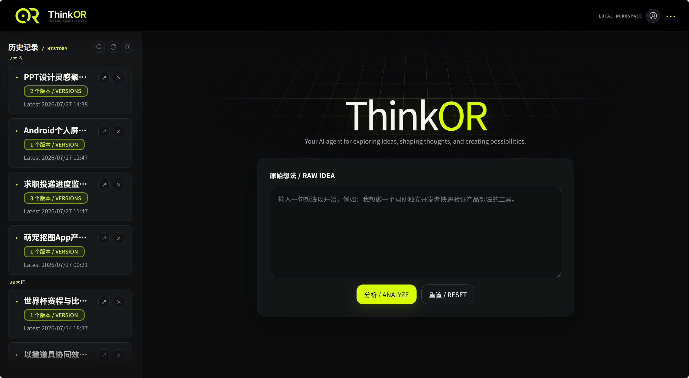
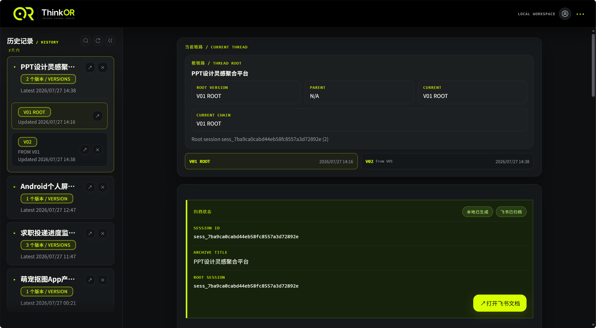
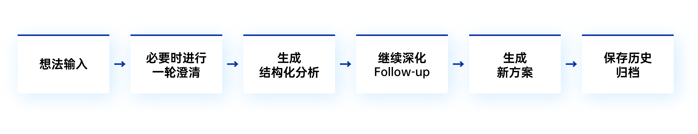

# ThinkOR：让想法拥有自己的生命周期

ThinkOR 是我尝试回答一个问题的开始：

人每天产生那么多奇思妙想，要怎么实现呢？

LLM 横空出世，我曾以为这就是这个问题最完美的答案。但我发现实际还是差一点：LLM 并不会真正管理你的想法。

大多数聊天机器人把"想法"当成聊天记录中的一段文本。

当上下文越来越长，它会受到历史内容影响；当信息不足，它会倾向于补全细节；当一次聊天结束，这个想法也随之淹没在新的消息里。

ThinkOR 试图换一种方式。

在这里，一个想法不是一段 Context，也不是一次 Conversation，而是一个可以持续演进的对象（Idea Object）。

每一次分析都围绕这个对象展开：澄清未知、识别信息缺口、形成结构化方案、记录版本演进，并让后续所有 Follow-up 都服务于同一个想法，而不是继续堆积聊天记录。

它不追求成为另一个万能 AI，而希望成为一个真正帮助你思考和孵化想法的系统。

## 界面预览

<p align="center">
  
  
</p>

## 它可以做什么

ThinkOR 围绕一条完整但足够克制的工作流展开：

<p align="center">
  
</p>

在这个过程中，它不会无限追问，也不会无限聊天，而是尽可能让每一次交互都推动想法向前演进。

当前版本支持：

- 有界澄清：仅在必要时提出有限的问题，帮助补全上下文。
- 结构化分析：围绕可行性、市场、资源、风险、MVP、长期方向等维度输出完整分析。
- Follow-up 演进：支持针对已有方案继续讨论，而不是重新开始一次分析。
- 版本合成：根据 Follow-up 内容自动生成新的完整方案。
- 历史管理：所有完成态会话都会保存在本地 SQLite，并组织为 Idea Thread。
- 飞书归档（可选）：支持将分析结果同步归档到飞书文档。

## 快速开始

先 clone 仓库并进入目录：

```powershell
git clone https://github.com/DOSEfree/ThinkOR.git ThinkOR
cd ThinkOR
python -m pip install --upgrade pip
python -m pip install .
python -m uvicorn ideaos_agent.main:app --reload
```

说明：

- 上面的命令按 Windows PowerShell 编写
- 如果你希望隔离环境，可以自行使用 `conda` 或 `venv`，但不是首次体验这个 demo 的必需前提
- 第一次体验不需要创建 `.env`，也不需要准备 API Key 或飞书凭据
- 需要手动配置真实能力时，再执行 `copy .env.example .env`；在 macOS 或 Linux 上使用 `cp .env.example .env`

启动完成后访问：

- `http://127.0.0.1:8000/app`

第一次打开页面时，ThinkOR 默认使用 Fake LLM 和 Fake Archive，因此无需配置任何 API Key，即可完整体验分析、澄清、版本演进和本地历史流程。

右上角的“菜单 / Menu”可打开运行设置。LLM 与飞书归档可独立选择 Fake 或 Real；面板在本机开发环境的 loopback 地址上可用，只会从 `.env.example` 创建 `.env`，或更新其中的 `IDEAOS_USE_FAKE_LLM` 与 `IDEAOS_USE_FAKE_ARCHIVE`。API Key、模型名、飞书 Token、代理凭据等 Secret 必须由用户在本机 `.env` 手动填写，页面不会接收、展示或返回这些值。

如果希望接入自己的模型或启用真实飞书归档，可以参考 [SETUP.md](SETUP.md)。

### 更新已 Clone 的项目

停止服务后，在 ThinkOR 项目根目录更新代码并重新安装本地包，再启动服务：

```powershell
git pull --ff-only
python -m pip install .
python -m uvicorn ideaos_agent.main:app --reload
```

`.env` 和 `data/ideaos_agent.db` 是本机私有配置与历史，不会被 Git 更新覆盖。通过 ZIP 下载或复制得到的目录不包含 `.git`，不能使用 `git pull`；请先 clone 到新的目录，再仅迁移 `.env` 与 `data/`。

## 项目结构

```text
src/ideaos_agent/
├── api/
├── application/
├── domain/
├── infrastructure/
├── presentation/
├── prompts/
├── config.py
├── main.py
└── models.py
```

项目保持当前分层：`api / application / domain / infrastructure / presentation / prompts`。  
这让接口、业务编排、领域模型、基础设施适配和前端展示相互解耦，便于后续继续增量演进。

## 运行模式与本地配置

| 场景 | LLM | 飞书归档 | 结果 |
| --- | --- | --- | --- |
| 默认体验 | Fake | Fake | 不调用真实 API，也不写入飞书 |
| 验证模型 | Real | Fake | 调用本机 `.env` 中的真实 LLM，不写入飞书 |
| 真实归档 | Real | Real | 调用真实 LLM，并尝试写入飞书 |
| 模拟内容归档 | Fake | Real | 必须在页面显式确认后才可保存；会写入真实飞书 |

面板保存后的模式对后续请求立即生效。显式设置的系统环境变量优先于 `.env`；页面会提示此类覆盖，避免用户误以为保存未生效。真实 LLM 不会被系统自动调用测试，真实飞书的“已授权”也只代表 CLI 准备就绪，首次成功归档才是最终验证。完整配置、飞书身份边界与排障方式见 [SETUP.md](SETUP.md)。

## 版本说明

版本变更记录见 [CHANGELOG.md](CHANGELOG.md)。

## 为什么是 ThinkOR？

我一直觉得，一个真正值得继续投入的想法，并不是在某一次聊天中突然诞生的。

它更像一个不断演进的过程：提出、澄清、分析、验证、推翻、重建，再逐渐变成可以执行的方案。

ThinkOR 想探索的，不是如何生成更多内容，而是如何帮助一个想法拥有自己的成长过程。

它是这个方向上的第一次实践 —— 也是我这个小白开发者，第一次在 GitHub 上鼓起勇气迈出的一步。

写到这里，倒不想说太多客套话。我更想说，如果你也有一个正在生长中的想法，欢迎拿它来试试 ThinkOR。

项目还有很多不成熟的地方，但我会让它慢慢变好，希望它有一天，能配得上你的关注与支持。

欢迎各路大佬批评指正。
