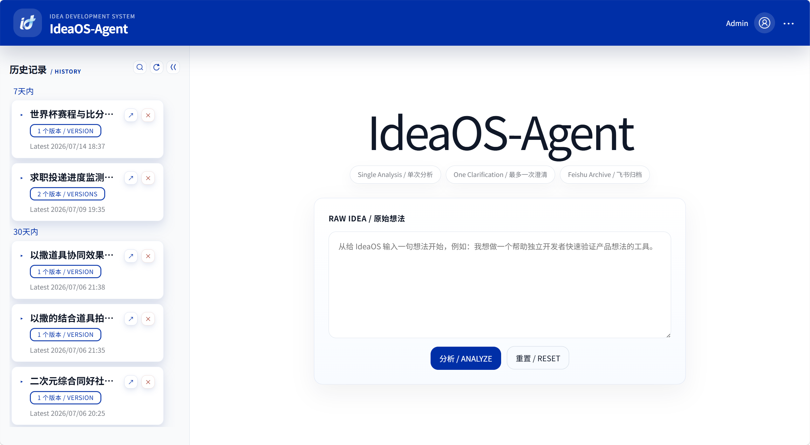
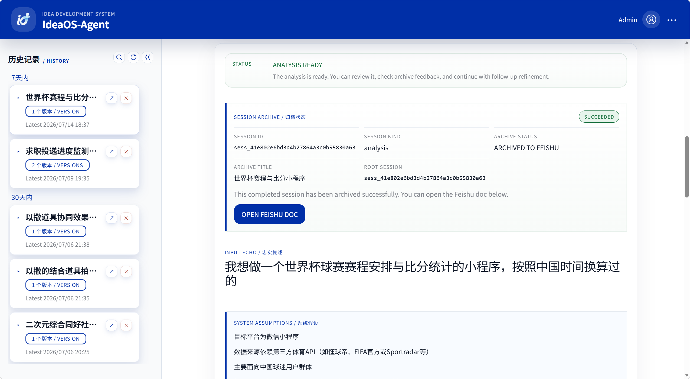

# IdeaOS-Agent：让想法拥有自己的生命周期

IdeaOS-Agent 是 IdeaOS 的第一个公开版本，也是我尝试回答一个问题的开始：

人每天产生那么多奇思妙想，要怎么实现呢？

LLM 横空出世，我曾以为这就是这个问题最完美的答案。但我发现实际还是差一点：LLM 并不会真正管理你的想法。

大多数聊天机器人把"想法"当成聊天记录中的一段文本。

当上下文越来越长，它会受到历史内容影响；当信息不足，它会倾向于补全细节；当一次聊天结束，这个想法也随之淹没在新的消息里。

IdeaOS 试图换一种方式。

在这里，一个想法不是一段 Context，也不是一次 Conversation，而是一个可以持续演进的对象（Idea Object）。

每一次分析都围绕这个对象展开：澄清未知、识别信息缺口、形成结构化方案、记录版本演进，并让后续所有 Follow-up 都服务于同一个想法，而不是继续堆积聊天记录。

它不追求成为另一个万能 AI，而希望成为一个真正帮助你思考和孵化想法的系统。

## 界面预览

<p align="center">
  
  
</p>

## 它可以做什么

IdeaOS-Agent 围绕一条完整但足够克制的工作流展开：

<p align="center">
  
</p>

在这个过程中，它不会无限追问，也不会无限聊天，而是尽可能让每一次交互都推动想法向前演进。

目前 `v0.5.0` 公开版本已经支持：

- 有界澄清：仅在必要时提出有限的问题，帮助补全上下文。
- 结构化分析：围绕可行性、市场、资源、风险、MVP、长期方向等维度输出完整分析。
- Follow-up 演进：支持针对已有方案继续讨论，而不是重新开始一次分析。
- 版本合成：根据 Follow-up 内容自动生成新的完整方案。
- 历史管理：所有完成态会话都会保存在本地 SQLite，并组织为 Idea Thread。
- 飞书归档（可选）：支持将分析结果同步归档到飞书文档。

## 快速开始

先 clone 仓库并进入目录：

```powershell
git clone https://github.com/DOSEfree/IdeaOS-agent.git IdeaOS-Agent
cd IdeaOS-Agent
python -m pip install --upgrade pip
python -m pip install .
copy .env.example .env
python -m uvicorn ideaos_agent.main:app --reload
```

说明：

- 上面的命令按 Windows PowerShell 编写
- 如果你使用 macOS 或 Linux，请把 `copy .env.example .env` 改成 `cp .env.example .env`
- 如果你希望隔离环境，可以自行使用 `conda` 或 `venv`，但不是首次体验这个 demo 的必需前提

启动完成后访问：

- `http://127.0.0.1:8000/app`

默认配置已经启用了 Fake LLM 和 Fake Archive，因此第一次运行无需配置任何 API Key，即可完整体验整个流程。

如果希望接入自己的模型或启用真实飞书归档，可以参考 [SETUP.md](SETUP.md)。

## 项目结构

```text
src/ideaos_agent/
├── api/
├── application/
├── domain/
├── infrastructure/
├── presentation/
├── prompts/
├── config.py
├── main.py
└── models.py
```

项目保持当前分层：`api / application / domain / infrastructure / presentation / prompts`。  
这让接口、业务编排、领域模型、基础设施适配和前端展示相互解耦，便于后续继续增量演进。

## 运行模式

| 模式   | LLM  | 归档   |
| ---- | ---- | ---- |
| 默认体验 | Fake | Fake |
| 开发调试 | Real | Fake |
| 完整模式 | Real | Real |

切换方式仅需修改 `.env` 中的环境变量即可，具体配置请参考 [SETUP.md](SETUP.md)。

## 版本说明

版本变更记录见 [CHANGELOG.md](CHANGELOG.md)。

## 为什么是 IdeaOS？

我一直觉得，一个真正值得继续投入的想法，并不是在某一次聊天中突然诞生的。

它更像一个不断演进的过程：提出、澄清、分析、验证、推翻、重建，再逐渐变成可以执行的方案。

IdeaOS 想探索的，不是如何生成更多内容，而是如何帮助一个想法拥有自己的成长过程。

IdeaOS-Agent 是这个方向上的第一次实践 —— 也是我这个小白开发者，第一次在 GitHub 上鼓起勇气迈出的一步。

写到这里，倒不想说太多客套话。我更想说，如果你也有一个正在生长中的想法，欢迎拿它来试试 IdeaOS。

项目还有很多不成熟的地方，但我会让它慢慢变好，希望它有一天，能配得上你的关注与支持。

欢迎各路大佬批评指正。
